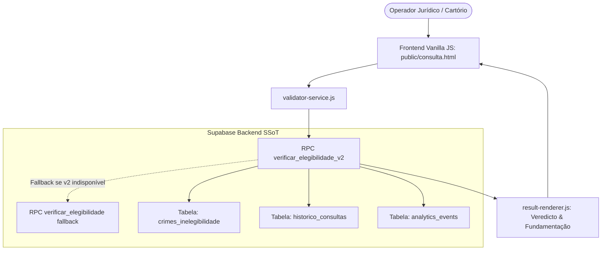

# 🏛️ Arquitetura — Inelegis (`ineleg-app`)

Este documento descreve a arquitetura do sistema de consulta de inelegibilidades eleitorais, suas camadas, fluxos de validação jurídica e contratos de dados.

> Documentação detalhada e registros de decisão arquitetural (ADRs): [`docs/architecture-and-adr.md`](docs/architecture-and-adr.md).

---

## 🎯 1. Visão Geral da Arquitetura

O Inelegis é uma aplicação web estática de alto desempenho (Vanilla JS) com lógica jurídica crítica delegada diretamente ao banco de dados Supabase via RPCs (Remote Procedure Calls) versionadas:



---

## ⚖️ 2. Princípios de Validação Jurídica

1. **SSoT Normativo no Banco de Dados:**
   - A tabela `crimes_inelegibilidade` é a fonte canônica oficial, alinhada à tabela oficial da Corregedoria Regional Eleitoral (CRE/TRE-RO).
   - As regras de incidência da **Lei Complementar nº 64/1990** e da **Lei da Ficha Limpa (LC 135/2010)** residem nas RPCs do PostgreSQL.
2. **Normalização Defensiva de Entrada:**
   - O serviço frontend e a RPC tratam variações jurídicas textuais comuns (`caput`, `único`, parágrafos e incisos combinados `c.c.`), prevenindo falsos negativos ou pesquisas nulas por discrepância tipográfica.
3. **Audit Trail Completo:**
   - Cada consulta registra o veredicto jurídico gerado e metadados analíticos na tabela `historico_consultas` para fins de auditoria interna.

---

## 🏗️ 3. Camadas do Sistema

| Camada                       | Responsabilidade                                             | Arquivos Principais                                 |
| :--------------------------- | :----------------------------------------------------------- | :-------------------------------------------------- |
| **Interface (UI)**           | Coleta de dados (Lei/Código/Artigo) e exibição de veredictos | `public/consulta.html`, `src/js/ui/validator-ui.js` |
| **Renderização**             | Formatação dos cards de status, fundamentação legal e prazos | `src/js/ui/result-renderer.js`                      |
| **Serviço de Validação**     | Orquestração da chamada das RPCs e normalização              | `src/js/services/validator-service.js`              |
| **Domínio Jurídico (DB)**    | Tabela canônica de crimes e RPCs de análise                  | `supabase/migrations/*.sql`                         |
| **Observabilidade & Uptime** | Keepalive Worker e Edge Function de disponibilidade          | `supabase/functions/keepalive/`                     |

---

## 📂 4. Organização de Arquivos

```text
ineleg-app/
├── public/                 # Assets públicos e páginas de consulta estáticas
│   ├── index.html          # Landing page institucional
│   ├── consulta.html       # Interface principal de consulta jurídica
│   └── assets/             # CSS institucional e distribuição JS
├── src/                    # Código-fonte JavaScript original
│   └── js/
│       ├── services/       # validator-service.js e cliente Supabase
│       └── ui/             # validator-ui.js e renderizadores
├── supabase/               # Migrações DDL e Edge Functions
│   └── migrations/         # DDL da tabela crimes_inelegibilidade e RPCs
├── docs/                   # Documentação detalhada e ADRs
├── AGENTS.md               # Governança de IA e jurisdição local
├── GEMINI.md               # Regras do Gemini
├── ARCHITECTURE.md         # Este documento
├── CHANGELOG.md            # Histórico de releases
├── CONTRIBUTING.md         # Guia de contribuição
├── SECURITY.md             # Políticas de segurança e auditoria
└── README.md               # Apresentação do projeto e instruções de execução
```
